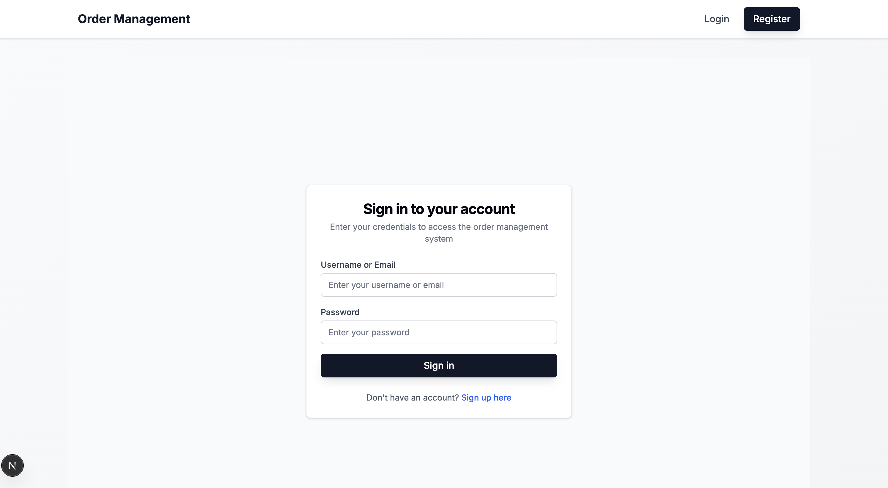
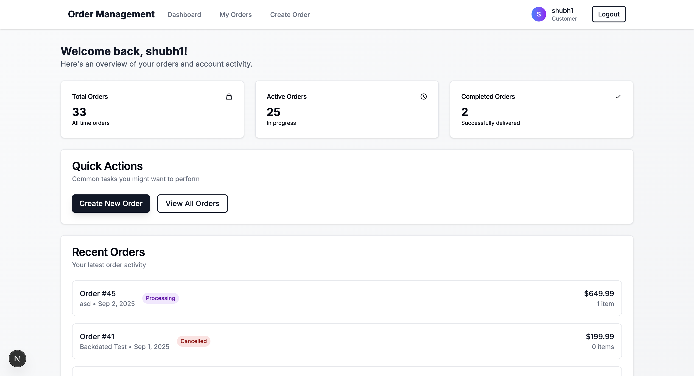
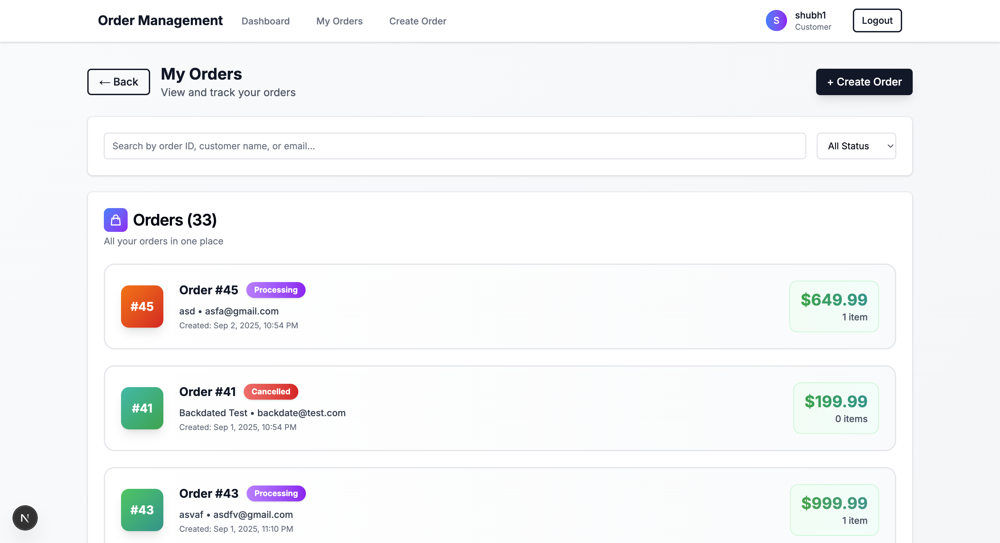
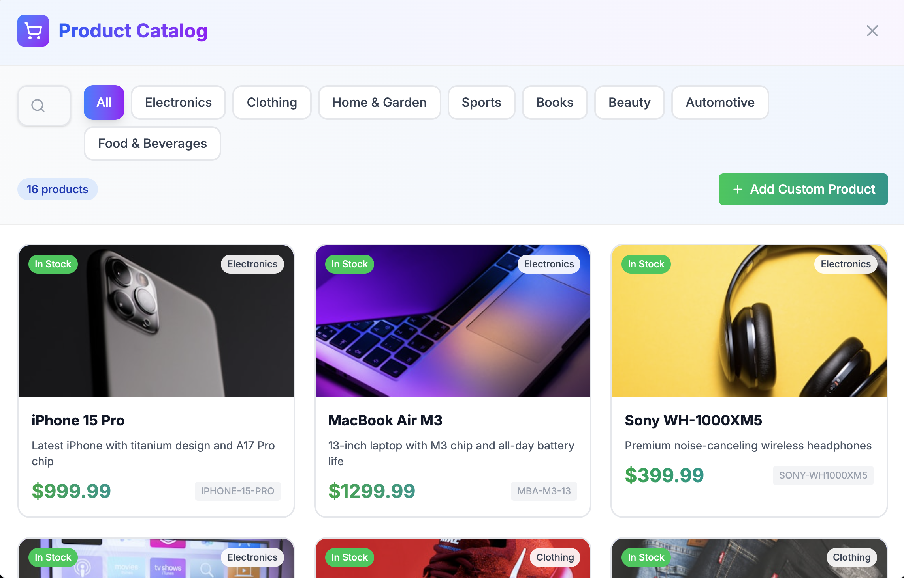

# E-Commerce Order Management System

**A Production-Ready Full-Stack Order Management Platform**

A comprehensive, enterprise-grade e-commerce order management system demonstrating modern software architecture, advanced backend engineering, and professional frontend development. Built with FastAPI and Next.js, featuring sophisticated role-based access control, real-time processing, and scalable design patterns.

---

## 🎯 **Project Overview**

This system showcases advanced full-stack development capabilities through a complete order management platform that handles the entire order lifecycle from creation to delivery. The architecture demonstrates expertise in:

- **Modern Backend Engineering**: FastAPI with advanced patterns
- **Professional Frontend Development**: Next.js 15 with TypeScript
- **Database Design**: Normalized schema with proper relationships
- **Authentication & Authorization**: JWT with role-based access control
- **Real-Time Processing**: Background jobs and automated workflows
- **Production-Ready Code**: Comprehensive logging, error handling, testing

---

## 🏗️ **System Architecture**

### **Backend Architecture (FastAPI)**
```
├── app/
│   ├── api/                    # API layer
│   │   ├── dependencies.py     # Dependency injection
│   │   └── routes/            # Endpoint definitions
│   ├── core/                  # Core system components
│   │   ├── config.py          # Configuration management
│   │   ├── database.py        # Database connection & session
│   │   ├── security.py        # JWT & password hashing
│   │   └── logging.py         # Structured logging setup
│   ├── models/                # SQLAlchemy ORM models
│   │   ├── base.py           # Base model with mixins
│   │   ├── user.py           # User model with roles
│   │   └── order.py          # Order & OrderItem models
│   ├── schemas/               # Pydantic schemas
│   ├── services/              # Business logic layer
│   │   └── order_service.py   # Order management logic
│   └── utils/                 # Utility functions
├── alembic/                   # Database migrations
├── tests/                     # Comprehensive test suite
└── background_jobs.py         # Automated order processing
```

### **Frontend Architecture (Next.js 15)**
```
├── src/
│   ├── app/                   # App Router (Next.js 15)
│   │   ├── auth/             # Authentication pages
│   │   ├── dashboard/        # Role-based dashboards
│   │   └── orders/           # Order management pages
│   ├── components/           # Reusable UI components
│   │   ├── auth/            # Authentication forms
│   │   ├── dashboard/       # Dashboard components
│   │   ├── orders/          # Order-related components
│   │   ├── ui/              # Base UI components
│   │   └── layout/          # Layout components
│   ├── hooks/               # Custom React hooks
│   │   └── useAuth.ts       # Authentication state management
│   ├── lib/                 # Core libraries
│   │   ├── api.ts           # API client with interceptors
│   │   └── utils.ts         # Utility functions
│   ├── types/               # TypeScript type definitions
│   └── utils/               # Frontend utilities
```

---

## 🚀 **Quick Start Guide**

### **Prerequisites**
- **Python 3.11+** (Backend)
- **Node.js 18+** (Frontend)
- **Git** (Version control)

### **1. Backend Setup**
```bash
# Clone and navigate
git clone <repository>
cd ecommerce-order-system/backend-v2

# Virtual environment setup
python -m venv venv
source venv/bin/activate

# Install dependencies
pip install -r requirements.txt

# Database initialization
alembic upgrade head

# Start server (simplified command)
python main.py
```
**Backend runs at**: `http://localhost:8000`  
**API Documentation**: `http://localhost:8000/docs`

### **2. Frontend Setup**
```bash
# Navigate to frontend
cd ../frontend

# Install dependencies
npm install

# Start development server
npm run dev
```
**Frontend runs at**: `http://localhost:3000`

### **3. Test the System**
```bash
# Create test users via API or frontend registration
# Default roles: customer, vendor, admin
# Test different role-based functionalities
```

---

## 📸 **Application Screenshots**

### **Authentication & Login**

*Professional login interface with form validation and responsive design*

### **Customer Dashboard**

*Role-based dashboard showing order statistics, quick actions, and recent order activity*

### **Order Management**

*Comprehensive order listing with filtering, search, and status management*

### **Product Catalog**

*Interactive product selection with categories, search, and inventory management*

---

## 🎨 **Advanced Features Implemented**

### **🔐 Authentication & Authorization**
- **JWT Token Management**: Secure token-based authentication
- **Role-Based Access Control (RBAC)**: Three-tier permission system
- **Session Management**: Persistent login with token refresh
- **Password Security**: Bcrypt hashing with salt
- **Permission Validation**: Endpoint-level and UI-level restrictions

### **📊 Order Management System**
- **Complete Order Lifecycle**: From creation to delivery
- **Status Workflow Engine**: Automated state transitions
- **Business Rule Enforcement**: Time-based cancellation policies
- **Order Item Management**: Multi-product orders with pricing
- **Advanced Filtering**: Status, date, customer-based filters

### **⚡ Real-Time Processing**
- **Background Job System**: Automated order status updates
- **Scheduled Tasks**: 60-second interval processing
- **IST Timezone Handling**: Proper datetime management
- **Manual Triggers**: On-demand batch processing
- **Concurrent Processing**: Async/await patterns

### **🎯 Role-Based Features**

#### **Customer Role**
- Personal order creation and management
- Order history with filtering
- Time-limited cancellation (5-minute window)
- Session-isolated data access

#### **Vendor Role**
- System-wide order visibility
- Order status management (Processing → Shipped → Delivered)
- Advanced filtering and search capabilities
- Order analytics and statistics

#### **Admin Role**
- Complete system oversight
- User management capabilities
- Full order control and modification
- System health monitoring

### **🔄 Advanced Backend Engineering**

#### **Database Design**
- **Normalized Schema**: Proper entity relationships
- **UUID Primary Keys**: Scalable identifier system
- **Audit Trails**: Created/updated timestamps
- **Enum Constraints**: Type-safe status management
- **Foreign Key Relationships**: Data integrity enforcement

#### **Service Layer Architecture**
- **Business Logic Separation**: Clean architecture principles
- **Transaction Management**: ACID compliance
- **Error Handling**: Comprehensive exception management
- **Logging Integration**: Structured logging with context
- **Dependency Injection**: FastAPI's DI system

#### **API Design**
- **RESTful Endpoints**: Standard HTTP methods
- **Pydantic Validation**: Request/response schemas
- **OpenAPI Documentation**: Auto-generated API docs
- **CORS Configuration**: Cross-origin resource sharing
- **Middleware Integration**: Request/response processing

### **🎨 Frontend Engineering Excellence**

#### **Modern React Patterns**
- **Custom Hooks**: Reusable state logic (`useAuth`)
- **Component Composition**: Modular UI architecture
- **TypeScript Integration**: Full type safety
- **Form Management**: React Hook Form with validation
- **State Management**: Context + hooks pattern

#### **UI/UX Design**
- **Responsive Design**: Mobile-first approach
- **Professional Styling**: Tailwind CSS utility classes
- **Interactive Components**: Framer Motion animations
- **Accessibility**: ARIA labels and keyboard navigation
- **Loading States**: Skeleton screens and spinners

#### **Performance Optimization**
- **Code Splitting**: Next.js automatic optimization
- **Image Optimization**: Next.js Image component
- **Bundle Analysis**: Webpack bundle optimization
- **Caching Strategy**: API response caching

---

## 🛠️ **Technology Stack Deep Dive**

### **Backend Technologies**
| Technology | Version | Purpose | Advanced Features |
|------------|---------|---------|------------------|
| **FastAPI** | 0.104.1 | Web Framework | Async support, auto-docs, dependency injection |
| **SQLAlchemy** | 2.0.23 | ORM | Relationship mapping, query optimization |
| **Alembic** | 1.12.1 | Migrations | Version control for database schema |
| **Pydantic** | 2.5.0 | Validation | Type validation, serialization |
| **JWT** | 3.3.0 | Authentication | Token-based auth with expiration |
| **Structlog** | 23.2.0 | Logging | Structured logging with context |
| **Pytest** | 7.4.3 | Testing | Comprehensive test coverage |

### **Frontend Technologies**
| Technology | Version | Purpose | Advanced Features |
|------------|---------|---------|------------------|
| **Next.js** | 15.5.2 | React Framework | App Router, SSR, optimization |
| **TypeScript** | 5.x | Type Safety | Full type coverage, strict mode |
| **Tailwind CSS** | 4.x | Styling | Utility-first, responsive design |
| **React Hook Form** | 7.62.0 | Forms | Performance-optimized forms |
| **Axios** | 1.11.0 | HTTP Client | Interceptors, request/response handling |
| **Framer Motion** | 12.23.12 | Animations | Smooth transitions and interactions |
| **Zod** | 4.1.5 | Validation | Runtime type checking |

---

## 📊 **Database Schema Design**

### **Users Table**
```sql
CREATE TABLE users (
    id VARCHAR(36) PRIMARY KEY,
    username VARCHAR(50) UNIQUE NOT NULL,
    email VARCHAR(255) UNIQUE NOT NULL,
    hashed_password VARCHAR(255) NOT NULL,
    role ENUM('customer', 'vendor', 'admin') DEFAULT 'customer',
    full_name VARCHAR(255),
    phone VARCHAR(20),
    address TEXT,
    is_active BOOLEAN DEFAULT TRUE,
    is_verified BOOLEAN DEFAULT FALSE,
    created_at TIMESTAMP DEFAULT CURRENT_TIMESTAMP,
    updated_at TIMESTAMP DEFAULT CURRENT_TIMESTAMP ON UPDATE CURRENT_TIMESTAMP
);
```

### **Orders Table**
```sql
CREATE TABLE orders (
    id VARCHAR(36) PRIMARY KEY,
    user_id VARCHAR(36) NOT NULL,
    customer_name VARCHAR(255) NOT NULL,
    customer_email VARCHAR(255) NOT NULL,
    customer_phone VARCHAR(20),
    shipping_address TEXT NOT NULL,
    status ENUM('pending', 'processing', 'shipped', 'delivered', 'cancelled') DEFAULT 'pending',
    total_amount DECIMAL(10,2) NOT NULL DEFAULT 0.00,
    notes TEXT,
    tracking_number VARCHAR(100),
    created_at TIMESTAMP DEFAULT CURRENT_TIMESTAMP,
    updated_at TIMESTAMP DEFAULT CURRENT_TIMESTAMP ON UPDATE CURRENT_TIMESTAMP,
    FOREIGN KEY (user_id) REFERENCES users(id)
);
```

### **Order Items Table**
```sql
CREATE TABLE order_items (
    id VARCHAR(36) PRIMARY KEY,
    order_id VARCHAR(36) NOT NULL,
    product_name VARCHAR(255) NOT NULL,
    product_sku VARCHAR(100),
    quantity INTEGER NOT NULL DEFAULT 1,
    unit_price DECIMAL(10,2) NOT NULL,
    total_price DECIMAL(10,2) NOT NULL,
    product_description TEXT,
    created_at TIMESTAMP DEFAULT CURRENT_TIMESTAMP,
    updated_at TIMESTAMP DEFAULT CURRENT_TIMESTAMP ON UPDATE CURRENT_TIMESTAMP,
    FOREIGN KEY (order_id) REFERENCES orders(id) ON DELETE CASCADE
);
```

---

## 🔧 **Configuration Management**

### **Backend Configuration (.env)**
```env
# Database Configuration
DATABASE_URL=sqlite:///./ecommerce.db

# Security Configuration
SECRET_KEY=your-production-secret-key-here
ACCESS_TOKEN_EXPIRE_MINUTES=30
ALGORITHM=HS256

# Server Configuration
HOST=0.0.0.0
PORT=8000
DEBUG=False

# Timezone Configuration
TIMEZONE=Asia/Kolkata

# CORS Configuration
ALLOWED_ORIGINS=["http://localhost:3000", "https://yourdomain.com"]
```

### **Frontend Configuration (.env.local)**
```env
# API Configuration
NEXT_PUBLIC_API_URL=http://localhost:8000

# Feature Flags
NEXT_PUBLIC_ENABLE_ANALYTICS=false
NEXT_PUBLIC_DEBUG_MODE=false
```

---

## 🔐 **Security Implementation**

### **Authentication Security**
- **JWT Tokens**: Stateless authentication with expiration
- **Password Hashing**: Bcrypt with configurable rounds
- **Token Validation**: Middleware-based request validation
- **Session Management**: Secure token storage and refresh

### **Authorization Security**
- **Role-Based Access**: Granular permission system
- **Endpoint Protection**: Decorator-based route protection
- **Data Isolation**: User-specific data access
- **Permission Validation**: Both backend and frontend checks

### **Input Security**
- **Pydantic Validation**: Backend request validation
- **Zod Schemas**: Frontend form validation
- **SQL Injection Prevention**: ORM-based queries
- **XSS Protection**: Input sanitization

---

## ⚡ **Background Processing System**

### **Order Status Automation**
```python
class BackgroundJobManager:
    """Automated order processing system"""
    
    async def _process_pending_orders(self):
        # Find orders pending > 5 minutes
        # Auto-transition: PENDING → PROCESSING
        # IST timezone handling
        # Batch processing with error handling
```

### **Key Features**
- **Scheduled Execution**: 60-second intervals
- **Timezone Awareness**: IST (Asia/Kolkata) handling
- **Error Recovery**: Graceful failure handling
- **Manual Triggers**: On-demand processing endpoints
- **Audit Logging**: Comprehensive operation tracking

---

## 📊 **API Documentation**

### **Authentication Endpoints**
```
POST /api/auth/register    # User registration
POST /api/auth/login       # User authentication
GET  /api/auth/me          # Current user info
```

### **Order Management Endpoints**
```
GET    /api/orders/           # All orders (vendors/admins)
GET    /api/orders/my         # User orders (customers)
POST   /api/orders/           # Create order
GET    /api/orders/{id}       # Order details
PUT    /api/orders/{id}       # Update order
DELETE /api/orders/{id}/cancel # Cancel order
PUT    /api/orders/{id}/status # Update status
```

### **System Endpoints**
```
GET  /api/health             # Health check
POST /api/background/trigger # Manual job trigger
GET  /docs                   # Interactive API docs
```

---

## 🧪 **Testing Strategy**

### **Backend Testing**
```bash
# Run all tests
cd backend-v2
pytest tests/ -v

# Coverage report
pytest --cov=app tests/

# Specific test categories
pytest tests/test_auth.py      # Authentication tests
pytest tests/test_orders.py    # Order management tests
pytest tests/test_users.py     # User management tests
```

### **Test Coverage Areas**
- **Authentication Flow**: Login, registration, token validation
- **Order CRUD Operations**: Create, read, update, delete
- **Role-Based Access**: Permission validation
- **Business Logic**: Order status transitions
- **Error Handling**: Exception scenarios

---

## 🚀 **Production Deployment**

### **Environment Setup**
```bash
# Production backend
cp .env.example .env
# Configure production values

# Database migration
alembic upgrade head

# Production server
gunicorn main:app --host 0.0.0.0 --port 8000
```

### **Production Considerations**
- **Database**: PostgreSQL/MySQL for production
- **Security**: Strong SECRET_KEY, HTTPS enforcement
- **Monitoring**: Application performance monitoring
- **Logging**: Centralized log aggregation
- **Caching**: Redis for session/data caching
- **Load Balancing**: Multiple server instances

---

## 🔮 **Advanced Enhancements & Scalability**

### **Immediate Enhancements**
- **WebSocket Integration**: Real-time order updates
- **Email Notifications**: Order status change alerts
- **Payment Gateway**: Stripe/PayPal integration
- **File Uploads**: Product images and documents
- **Advanced Analytics**: Order metrics and reporting

### **Scalability Improvements**
- **Microservices Architecture**: Service decomposition
- **Message Queues**: Redis/RabbitMQ for async processing
- **Caching Layer**: Redis for performance optimization
- **Database Sharding**: Horizontal scaling strategy
- **CDN Integration**: Static asset optimization

### **Enterprise Features**
- **Multi-Tenant Support**: Organization-based isolation
- **API Rate Limiting**: Request throttling
- **Audit Logging**: Comprehensive activity tracking
- **Data Export**: CSV/Excel reporting capabilities
- **Advanced Search**: Elasticsearch integration

---

## 🎯 **Technical Achievements Demonstrated**

### **Backend Engineering**
✅ **Modern Python Development**: FastAPI, async/await, type hints  
✅ **Database Design**: Normalized schema, relationships, migrations  
✅ **API Design**: RESTful architecture, OpenAPI documentation  
✅ **Security Implementation**: JWT, RBAC, input validation  
✅ **Background Processing**: Automated workflows, scheduling  
✅ **Testing**: Comprehensive test coverage, pytest framework  
✅ **Logging**: Structured logging with contextual information  

### **Frontend Engineering**
✅ **Modern React**: Next.js 15, TypeScript, hooks patterns  
✅ **State Management**: Custom hooks, context API  
✅ **Form Handling**: React Hook Form, validation schemas  
✅ **UI/UX Design**: Responsive design, professional styling  
✅ **Performance**: Code splitting, optimization techniques  
✅ **Type Safety**: Full TypeScript implementation  

### **Full-Stack Integration**
✅ **API Integration**: Axios client with interceptors  
✅ **Authentication Flow**: JWT token management  
✅ **Error Handling**: Comprehensive error boundaries  
✅ **Real-Time Features**: Background job processing  
✅ **Role-Based UI**: Dynamic interface adaptation  

---

## 🤝 **Development Workflow**

### **Code Quality**
- **Type Safety**: Full TypeScript + Python type hints
- **Code Formatting**: Prettier (frontend) + Black (backend)
- **Linting**: ESLint (frontend) + Flake8 (backend)
- **Git Hooks**: Pre-commit validation

### **Development Process**
```bash
# Feature development
git checkout -b feature/new-feature
# Development and testing
git commit -m "feat: implement new feature"
git push origin feature/new-feature
# Pull request and review
```

---

## 📞 **Support & Troubleshooting**

### **Common Issues**

**Backend Issues:**
- **Database Connection**: Check DATABASE_URL configuration
- **Migration Errors**: Run `alembic upgrade head`
- **Permission Errors**: Verify virtual environment activation
- **Port Conflicts**: Modify PORT in .env file

**Frontend Issues:**
- **API Connection**: Verify NEXT_PUBLIC_API_URL
- **Build Errors**: Clear node_modules, reinstall dependencies
- **Authentication**: Check browser localStorage for tokens
- **CORS Errors**: Verify backend ALLOWED_ORIGINS

### **Debug Mode**
```bash
# Backend debugging
DEBUG=True python main.py

# Frontend debugging
NEXT_PUBLIC_DEBUG_MODE=true npm run dev
```

---

**This system demonstrates production-ready full-stack development with modern technologies, advanced architectural patterns, and comprehensive feature implementation suitable for enterprise environments.****
